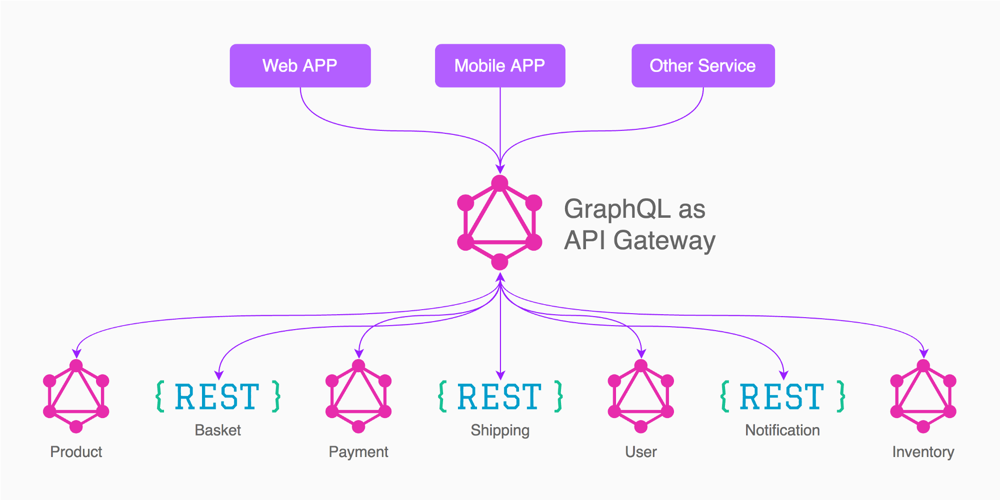

# GraphQL

Een query language welke gemaakt is voor het web.
[GraphQL](https://graphql.org/) een API protocol wat gemaakt is door Facebook
als vervanging voor REST.

Met GraphQL kan exact alle data van de server omschreven worden, welk veldje
komt waar, wat is de relatie van een product tot een ander product to een
categorie, etc.

Met GraphQL kunnen we precies de data opvragen welke nodig en krijgen op die
manier nooit te veel data terug.

GraphQL is de toekomst en veel software pakketten beginnen nu met het
ondersteunen hier van.

- Magento 2 is hard op weg om dit op orde te krijgen,
- Shopify heeft al een GraphQL API
- Shopware heeft nog geen first-class GraphQL API

## GraphQL Mesh

[GraphQL Mesh](https://graphql-mesh.com/) stelt on in staat om GraphQL te
gebruiken om een externe non-GraphQL API om te zetten naar GraphQL.

Daarnaast stelt GraphQL Mesh het ons in staat om al deze GraphQL endpoints samen
te voegen tot één Graph.



GraphQL Mesh kan de volgende protocollen omzetten en samenvoegen:

- Swagger, OpenAPI 2/3 (Klassieke REST endpoints)
- MySQL / PostgreSQL / SQLite (dabases)
- OData (Microsoft)
- SOAP endpoints
- gRPC and Protobuf schemas (Google)
- JSON schema structure
- GraphQL (alleen samenvoegen)
- Apollo Federation Services
- En nog vele andere

Mocht het nodig zijn is het eenvoudig om zelf een custom handler te schrijven.

## GraphQL Playground


## GraphQL Code Generator

Met behulp van [GraphQL Code Generator](https://graphql-code-generator.com/) kan
van GraphQL Mesh automatisch code gegenereerd worden:

```graphql
query BlogList($url: String!) {
  blogPosts: pages(
    where: { url_starts_with: $url }
    orderBy: releaseDate_DESC
  ) {
    id
    releaseDate
    title
    metaRobots
    url
  }
}
```

Roep data gemakkelijk op, door het gegenereerde document `BlogListDocument` aan
te roepen:

```tsx
const MyReactComponent = () => {
  const { data } = useQuery({
    query: BlogListDocument,
    variables: { url: '/blog/' },
  })

  return (
    <ul>
      {data.blogPosts.map((blogPost) => (
        <li>{blogPost.title}</li>
      ))}
    </ul>
  )
}
```
