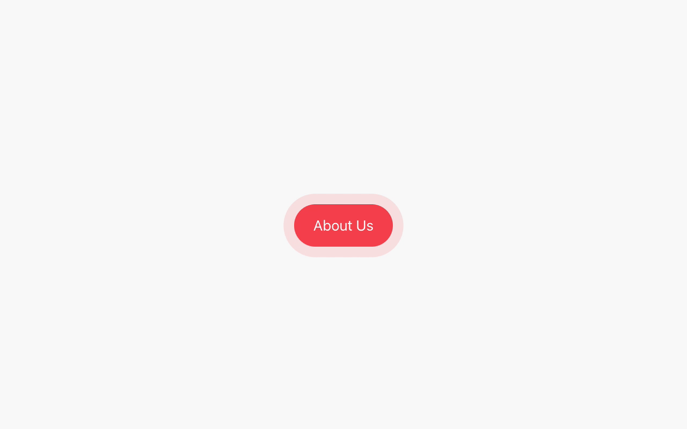

# Theming

The GraphCommerce [magento-graphcms]() example and GraphCommerce components are
built with [MUI ↗](https://mui.com/). MUI provides a robust, customizable, and
accessible library of foundational and advanced components, enabling you to
build your design system and develop React applications faster.

This guide covers GraphCommerce helper functions and how to customize your
GraphCommerce storefront.

## Changing the color palette

The global styles or your GraphCommerce app are located in /components/theme.ts.
To customize the app with your preferred colors, change the primary, secondary
and text colors. Save the file to see your changes updated in real-time:

```
  primary: {
    main: '#FF4A55',
    contrastText: '#FFFFFF',
    dark: '#F33642',
  },
  secondary: {
    main: '#006BFF',
    light: '#D1E4FF',
    contrastText: '#ffffff',
  },
  ...
  text: {
    primary: '#000000',
    secondary: '#00000050',
    disabled: '#00000030',
  },
```

You can search through your codebase to discover which component will be
affected by your changes. For example, search for occurances of
`theme.palette.primary.main`.

## Styling component with props

Most components can be styled using props. Most common are the `color` and
`variant` props:

```
<Button
  ...
  color='primary'
  variant='pill'
  >
</Button>
```

- Learn about a component's features from the MUI documentation:
  [MUI Button documentation ↗](https://mui.com/components/buttons/)
- To learn which options are accepted by a prop, take a look at the component's
  API: [MUI Button API ↗](https://mui.com/api/button/). You can also use your
  IDE's suggestions functionality. For Vscode's IntelliSense feature, type
  Ctrl+Space.

## Creating styled components with the styled() utility

A simple way to style a component is by using the
[sx prop ↗](https://mui.com/system/the-sx-prop/). A more advanced way is to use
the [MUI styled() ↗](https://mui.com/system/styled/) utility for creating styled
components:

```
import { styled } from '@mui/material'
```

```
const AnimatedButton = styled(Button, { name: 'animatedButton' })(({ theme }) => ({
  '@keyframes pulse': {
    '0%': {
      boxShadow: `0 0 0 0 ${theme.palette.primary.main}`,
    },
    '100%': {
      boxShadow: `0 0 0 15px ${theme.palette.background.default}`,
    },
  },
  animation: 'pulse 1.5s infinite',
}))
```

```
<AnimatedButton color='primary' variant='pill'>
  <Trans>About Us</Trans>
</AnimatedButton>
```

<figure>
 
 <figcaption>Example of a styled component</figcaption>
</figure>

### Global overwrites

## Graphcommerce custom variants

## Typography and custom fonts

## GraphCommerce helper functions

### responsiveVal

### breakpointVal

If you take a look at the source code of the component, by looking it up in the
MUI repository
[MUI Button source code ↗](https://github.com/mui/material-ui/blob/master/packages/mui-material/src/Button/Button.js)

## Next steps

- Take a look at MUI's
  [Default Theme object ↗](https://mui.com/customization/default-theme/) in the
  MUI documentation
- Learn more about a component's default styles by looking them up in the
  [MUI repository ↗](https://github.com/mui/material-ui/tree/master/packages/mui-material/src)
