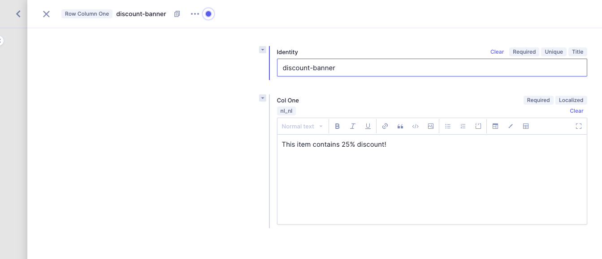
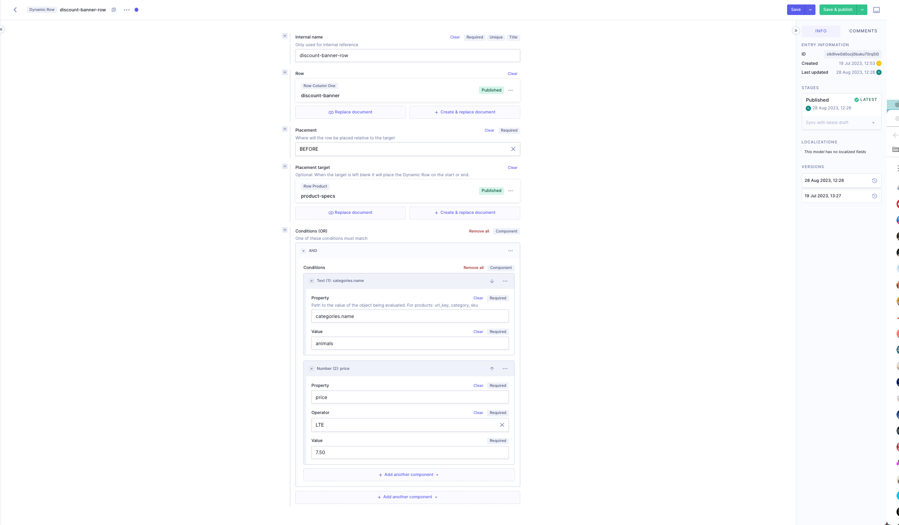

# Hygraph Dynamic Rows

In some cases you might want to inject the same rows on different pages on your
website. In the traditional situation, this would require to add a relation
between this row and the specific pages manually. This is where it gets a bit
messy. That's why we invented Dynamic Rows! Dynamic Rows make it possible to
inject rows into multiple pages using common properties between those pages. An
example of such property would be the url key. Let's take a deeper look.

> Note
>
> The Dynamic Row functionality is available since Graphcommerce 6.2.

### How does it work?

The magic of the Dynamic Row functionality, is all in the `HygrahPageContent()`
function. This function takes 4 arguments.

1. The graphql client
2. The current page URL
3. Optional: The properties to match the dynamic row with. This should be an
   object.
4. Optional: Cached (standard false)

### The structure of a Dynamic Row

To inject a dynamic row, go to Hygraph and add a Dynamic Row entry. You will see
the following fields:

1. Internal name. This is the name of the Dynamic Row and will primarily be used
   as for recognition.
2. Row. This is the Row you want to inject. i.e. a Row Column One or a Row
   Links.
3. Placement. You can place the injection before or after the placement target.
   You can also replace the placement target.
4. Placement Target. The row you want to place the Dynamic row before, after or
   replaced.
5. Conditions. Here you will match which pages should display the dynamic row.

### Placement

Placement has a few key behaviours.

1. When placement target is empty or not found, and before is selected, the
   Dynamic Row will be placed first.
2. When placement target is empty or not found, and after or replace is
   selected, the Dynamic Row will be placed last.
3. When placement target is found, the injected row will be placed before, after
   or replace the placement target accordingly.

### Conditions

The conditions are matched against the properties of the pages you want to
inject upon. As explained in 'How does it work?' we can give an object of
properties to a page.

The conditions fields works as follows:

- We can match against string or number values using the Text and Number
  components.
- Text and Number components contain a property and a value field. This way we
  can match values against the page properties. If there is a match the Dynamic
  Row will be injected.
- The property can be accessed with javascript dot notation. If the object
  contains an array of objects, you don't have to use bracket notation. Let's
  say caterogies is an array of category objects which hold the category name:

  ```tsx
    {
      categories [
        {
          name: "Animals",
        },
        {
          name: "Landscapes",
        },
      ]
    }
  ```

  In this case, the property field can be accessed using `categories.name`
  syntax.

- Number components contain an additional field called operator. Here we can
  match if a number is equal to, greater than or lower than.
- We can implement logic with the And & Or components. These components allow
  nesting of Text and Number components.

### Injecting a Dynamic Row

Let's say we want to inject a Dynamic Row which displays a discount banner for
all socks with animal prints with a price lower than €7.50. We want to place it
right after the product specs:

1. We name the Dynamic Row `discount-banner-row`
2. The row we want to inject. In this case the row `discount-banner`.
   
3. We set the placement on `BEFORE`
4. The placement target will be `product-specs`
5. For the conditions we will use the `Text` and `Number` components nested in
   an `AND` component.

The result is as follows:



The Dynamic Row should now be injected on all the pages whose properties match
the conditions. 
