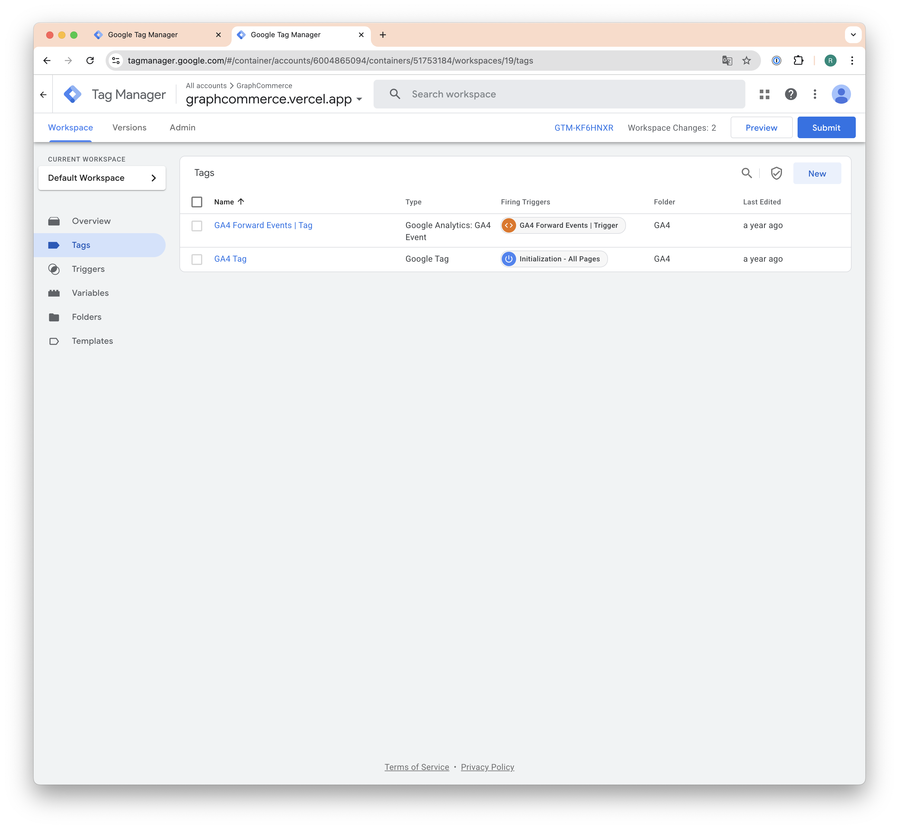
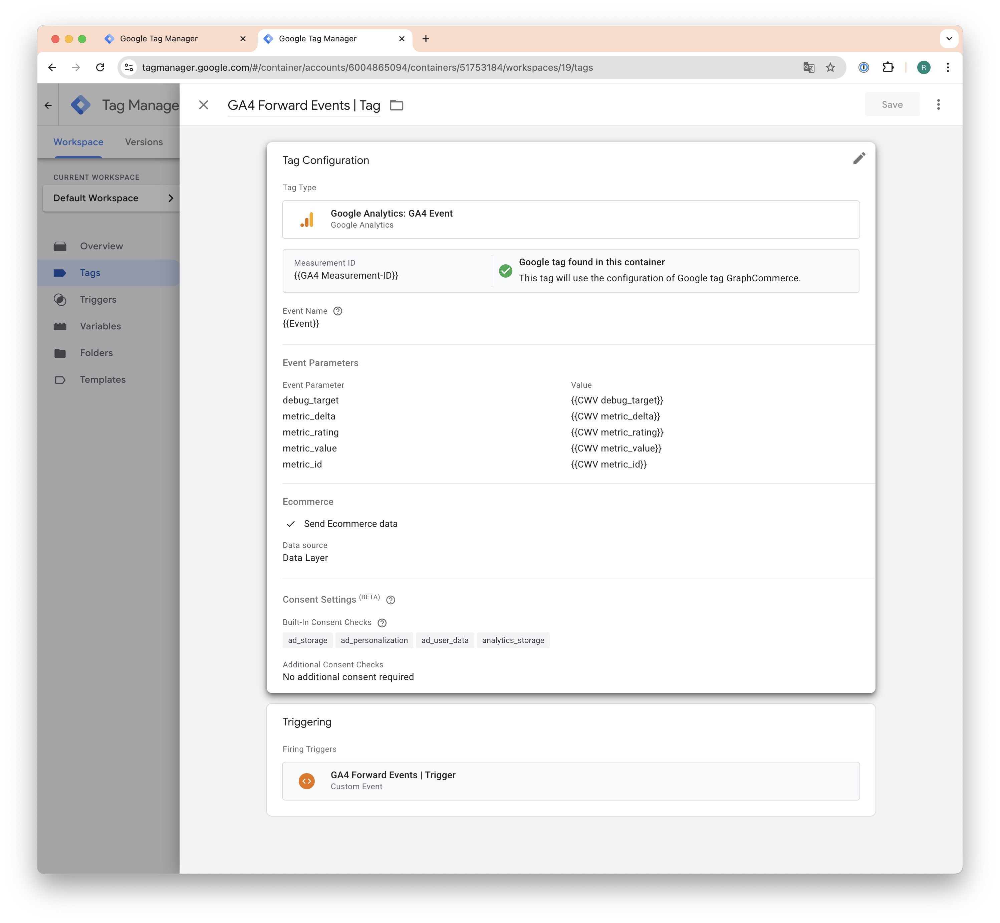
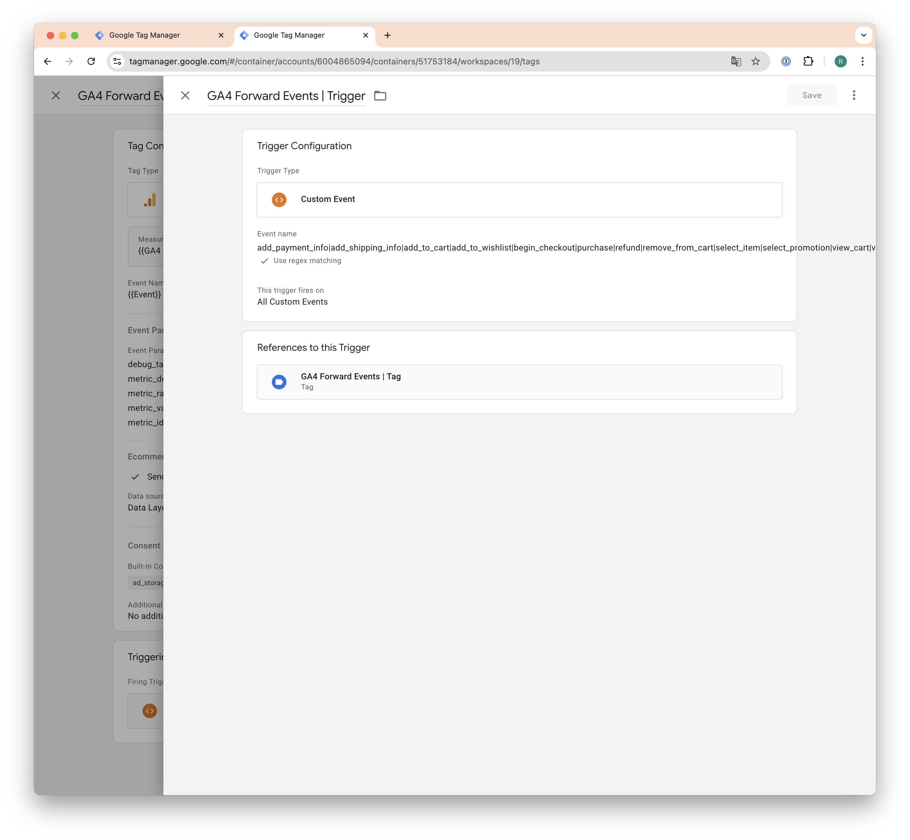
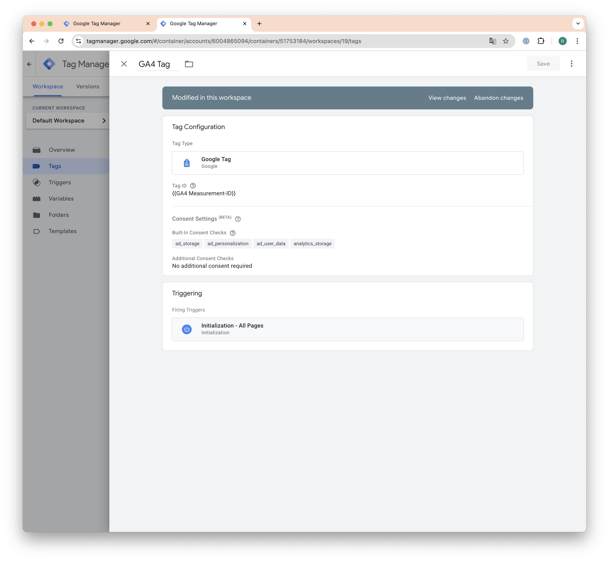
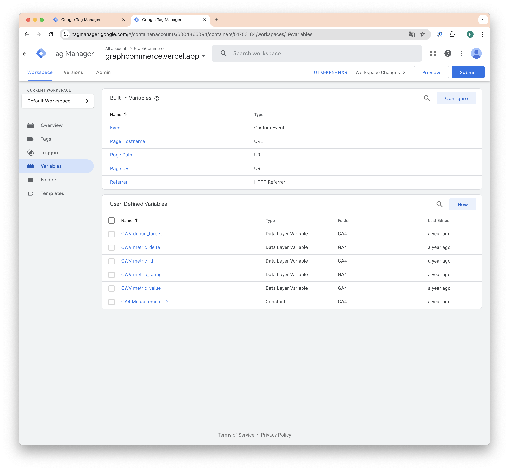

# @graphcommerce/googletagmanager

This package makes it easy to add Google Tag Manager to your GraphCommerce
webshop.

## Configuration

Configure the following ([configuration values](./Config.graphqls)) in your
graphcommerce.config.js

  
  
  
  

